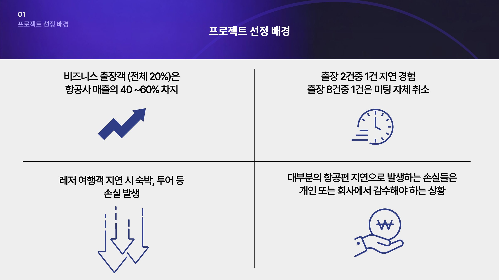
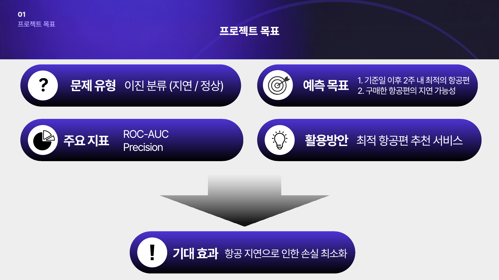
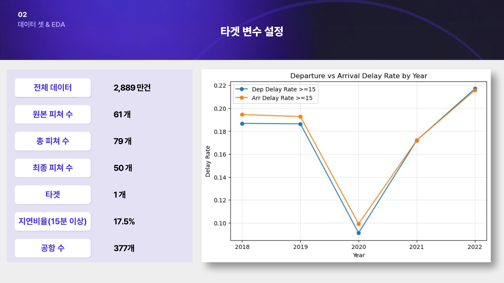
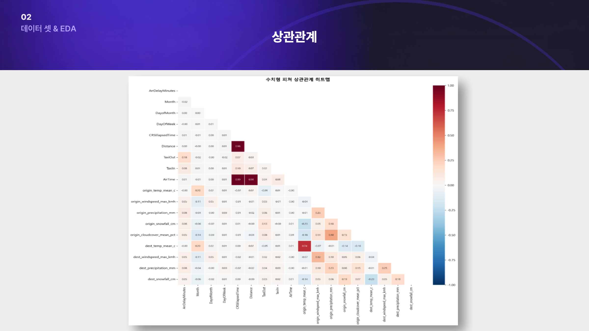
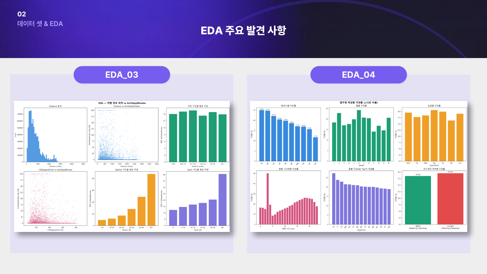
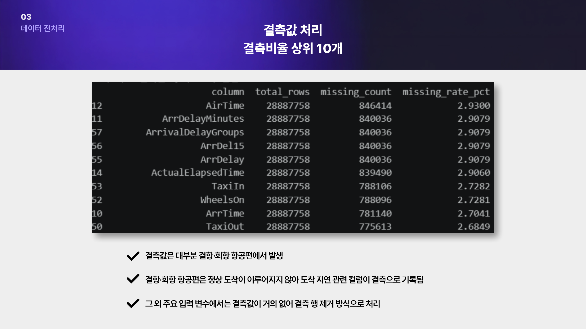
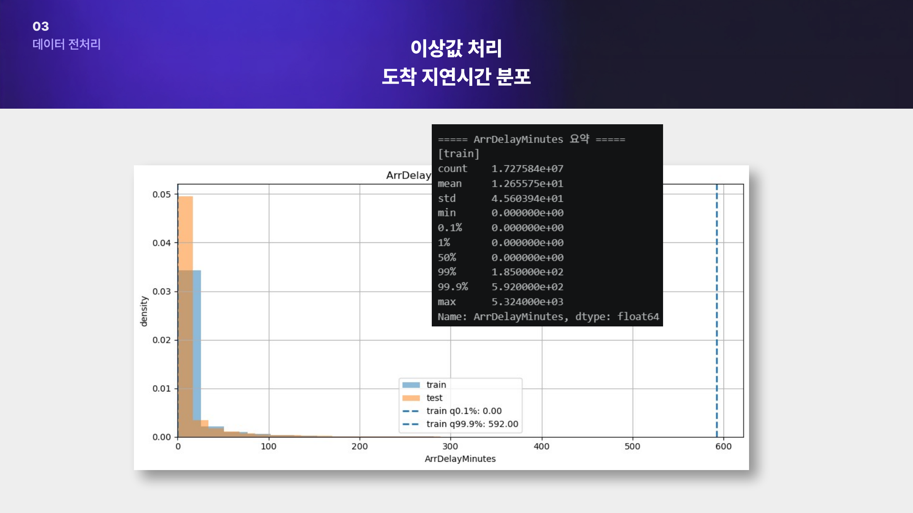
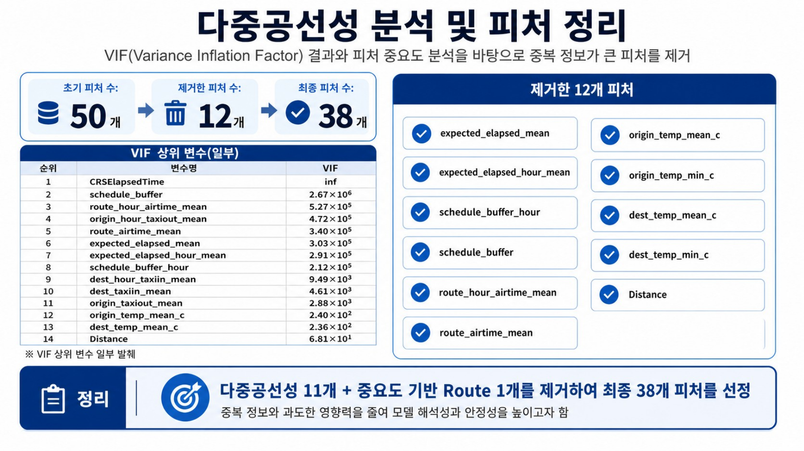
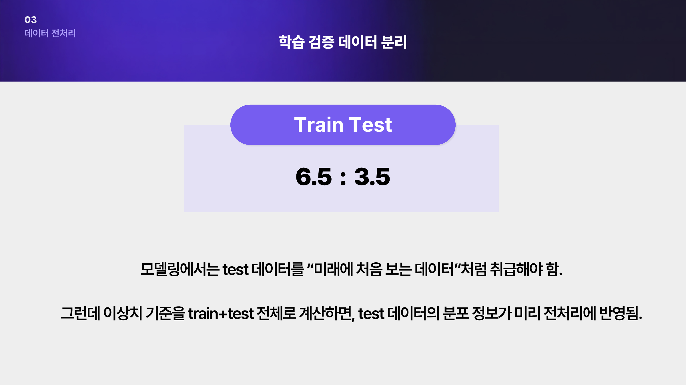

# 📄 산출물 1: 인공지능 데이터 전처리 결과서

## 항공편 지연 및 노선 예측 프로젝트

> 프로젝트명: **SKY CASTER - 항공편 지연 및 노선 예측**  
> 목적: 사용자가 예약하려는 항공편 또는 노선의 지연 가능성을 사전에 예측하여, 더 안정적인 항공편 선택을 돕는 서비스 구현

---

## 1. 프로젝트 개요

### 1-1. 비즈니스 배경

항공편 지연은 단순히 비행기가 늦게 도착하는 문제가 아니라, 사용자의 일정과 비용에 직접적인 손실을 발생시키는 문제이다.  
비즈니스 출장객은 항공편 지연으로 인해 회의 일정이 밀리거나 취소될 수 있고, 여행객은 이미 결제한 숙박·투어·교통 예약에서 손실을 볼 수 있다.

본 프로젝트는 이러한 문제를 해결하기 위해 **항공편의 지연 가능성을 사전에 예측**하고, 사용자가 더 안정적인 항공편 또는 노선을 선택할 수 있도록 돕는 것을 목표로 한다.



### 1-2. 비즈니스 목표

- 사용자가 예약하려는 항공편의 지연 가능성을 사전에 확인할 수 있도록 한다.
- 동일한 목적지로 이동 가능한 여러 항공편 또는 노선 중 상대적으로 안정적인 선택지를 확인할 수 있도록 한다.
- 항공 지연으로 인한 일정 차질과 금전적 손실을 최소화한다.

### 1-3. 머신러닝 활용 계획

| 항목 | 내용 |
|---|---|
| 문제 유형 | 이진 분류 |
| 예측 대상 | 항공편의 지연 여부 |
| 지연 기준 | 도착 지연 15분 이상 |
| 타겟 생성 기준 | `ArrDelayMinutes >= 15`이면 지연(1), 그 외 정상(0) |
| 주요 평가지표 | ROC-AUC, Precision |
| 활용 방안 | 최적 항공편 추천, 구매 예정/구매 완료 항공편의 지연 가능성 확인 |
| 기대 효과 | 항공 지연으로 인한 일정 및 비용 손실 최소화 |



### 1-4. 성공 기준

본 프로젝트는 단순히 지연 여부를 맞히는 것보다, **지연 위험도가 높은 항공편을 정상 항공편보다 잘 구분하는 것**이 중요하다.  
따라서 모델 평가는 지연 위험도 순위를 얼마나 잘 구분하는지 확인할 수 있는 **ROC-AUC**와, 지연이라고 예측한 항공편 중 실제 지연 비율을 확인하는 **Precision**을 주요 기준으로 설정한다.

---

## 2. 데이터셋 소개

### 2-1. 데이터 기본 정보

| 항목 | 내용 |
|---|---:|
| 데이터셋명 | Flight Status Prediction |
| 데이터 출처 | Kaggle / BTS TranStats On-Time Performance 기반 항공 운항 데이터 |
| 수집 기간 | 2018.01 ~ 2022.07 |
| 전체 데이터 수 | 28,887,758건 |
| 원본 피쳐 수 | 61개 |
| 전체 피쳐 수 | 79개 |
| 1차 최종 피쳐 수 | 50개 |
| 다중공선성 및 중요도 정리 후 피쳐 수 | 38개 |
| 타겟 수 | 1개 |
| 지연 비율 | 약 17.5% |
| 공항 수 | 377개 |



### 2-2. 특성 목록 및 설명

전체 원본 컬럼은 61개이고, 날씨·스케줄·공항 혼잡도 관련 파생변수를 생성하여 전체 피쳐 수가 79개까지 증가하였다.  
이후 실제 예측 시점에 사용할 수 없는 컬럼, 중복성이 높은 컬럼, 중요도가 낮은 컬럼을 정리하여 최종 입력 피쳐를 구성하였다.

| 구분 | 주요 특성 | 설명 | 처리 방향 |
|---|---|---|---|
| 날짜 | `FlightDate`, `Month`, `DayofMonth`, `DayOfWeek` | 운항 날짜, 월, 일, 요일 | 날짜/요일/계절성 피쳐로 활용 |
| 예정 시간 | `CRSDepTime`, `CRSArrTime` | 예정 출발/도착 시각 | 분 단위 변환 후 sin/cos 순환 인코딩 |
| 항공사 | `Marketing_Airline_Network`, `Operating_Airline` | 마케팅 항공사, 실제 운항 항공사 | 범주형 피쳐로 활용 |
| 공항/노선 | `Origin`, `Dest`, `Route` | 출발 공항, 도착 공항, 노선 | 공항은 유지, `Route`는 최종 제거 |
| 거리/소요시간 | `Distance`, `CRSElapsedTime`, `AirTime` | 거리, 예정 소요시간, 실제 비행시간 | `AirTime`은 Leakage로 제거, 중복 피쳐 정리 |
| 지상 이동 | `TaxiOut`, `TaxiIn` | 게이트 이동 및 활주로 이동 시간 | 실제값 직접 사용 X, 과거 평균 집계값으로 대체 |
| 도착 지연 | `ArrDelayMinutes` | 도착 지연 시간 | 타겟 생성 기준 |
| 날씨 | `origin_*`, `dest_*` 기상 변수 | 출발지/도착지 강수, 적설, 기온, 풍속, 운량 | 원본값 유지 + 강수/적설 여부 이진 피쳐 생성 |

### 2-3. 타겟 변수 설정

본 프로젝트의 타겟은 `ArrDelayMinutes`를 기준으로 생성하였다.

```text
DelayTarget = 1 if ArrDelayMinutes >= 15 else 0
```

| 클래스 | 의미 |
|---|---|
| 0 | 정상 운항 또는 15분 미만 도착 지연 |
| 1 | 15분 이상 도착 지연 |

전체 데이터 기준 지연 비율은 약 **17.5%**로, 정상 항공편이 지연 항공편보다 훨씬 많은 불균형 데이터이다.  
따라서 모델 학습 및 평가 단계에서는 Accuracy만 보는 것이 아니라, ROC-AUC, Precision, Recall, F1 등을 함께 확인해야 한다.

---

## 3. 탐색적 데이터 분석(EDA)

### 3-1. 기초 데이터 구조 확인

원본 데이터는 약 2,889만 건으로 데이터 수가 매우 크기 때문에, 전체 데이터를 한 번에 세밀하게 시각화하기보다는 연도별·타겟별·주요 피쳐별로 나누어 탐색하였다.  
발표 자료에서는 전체 데이터 규모, 타겟 비율, 공항 수, 피쳐 수를 먼저 확인한 뒤, 지연 패턴과 피쳐 간 관계를 분석하였다.

### 3-2. 출발 지연과 도착 지연의 관계

연도별 지연률을 비교한 결과, 출발 지연률과 도착 지연률은 거의 비슷한 흐름을 보였다.  
특히 2020년에 지연률이 크게 낮아졌다가 2021~2022년에 다시 증가하는 패턴이 나타났다.

이는 항공편 지연이 단순히 특정 항공편 하나의 문제가 아니라, 전체 항공 수요, 운항 환경, 공항 혼잡도와 함께 변화하는 문제라는 점을 보여준다.


### 3-3. 수치형 특성 간 상관관계

상관관계 분석 결과, 일부 시간·거리 계열 피쳐에서 강한 상관관계가 확인되었다.  
예를 들어 비행 거리가 길어질수록 예정 소요시간과 실제 비행시간도 함께 증가하기 때문에, `Distance`, `CRSElapsedTime`, `AirTime`, 노선 평균 비행시간 계열 변수들이 서로 비슷한 정보를 담게 된다.



상관관계 분석을 통해 확인한 핵심은 다음과 같다.

| 발견 내용 | 전처리 반영 |
|---|---|
| 시간/거리 계열 피쳐 간 중복 정보 존재 | VIF 분석 및 피쳐 중요도 기반으로 중복 피쳐 제거 |
| `AirTime`, `TaxiOut`, `TaxiIn` 등은 지연과 관련성이 높지만 실제 운항 후 알 수 있음 | 직접 입력 피쳐에서 제거하거나 과거 평균값으로 대체 |
| 날씨 피쳐는 단순 선형 상관계수만으로는 영향이 약하게 보일 수 있음 | 강수/적설 여부 이진 피쳐 추가 |
| 시간대별 지연률 차이가 존재 | 예정 출발/도착 시간을 순환 인코딩 |

### 3-4. 특성별 분포 분석

EDA에서 확인한 주요 분포는 다음과 같다.




#### 3-4-1. 지연 구간별 분포

도착 지연 시간은 대부분 0분 또는 짧은 지연 구간에 몰려 있고, 일부 항공편에서 매우 긴 지연이 발생하는 long-tail 구조를 보였다.  
이 때문에 단순 회귀로 지연 시간을 그대로 예측하기보다, **15분 이상 지연 여부를 예측하는 이진 분류 문제**로 설정하는 것이 프로젝트 목적에 더 적합하다고 판단하였다.

#### 3-4-2. 시간대별 지연 패턴

출발 시간대가 늦어질수록 지연 가능성이 증가하는 패턴이 나타났다.  
이는 오전 항공편보다 오후·저녁 항공편에서 앞선 항공편의 지연이 누적될 가능성이 크기 때문이다.

따라서 `CRSDepTime`, `CRSArrTime`은 단순 숫자로 넣지 않고, 하루 24시간의 순환 구조를 반영하는 sin/cos 인코딩을 적용하였다.

#### 3-4-3. 날씨 변수의 영향

강수량과 적설량은 0 값이 많은 피쳐이다.  
연속형 값만 사용하면 모델이 “비 또는 눈이 왔는지 여부”를 명확하게 보기 어려울 수 있으므로, 다음과 같은 이진 피쳐를 생성하였다.

```text
origin_has_precip = origin_precipitation_mm > 0
dest_has_precip   = dest_precipitation_mm > 0
origin_has_snow   = origin_snowfall_cm > 0
dest_has_snow     = dest_snowfall_cm > 0
```

#### 3-4-4. 공항/노선 특성

공항과 노선은 항공편 지연에 중요한 영향을 줄 수 있다.  
다만 `Route`는 출발지와 도착지를 결합한 고유값이 많은 변수이기 때문에, 모델 복잡도를 높이고 다른 노선 평균 피쳐와 중복될 가능성이 있다.  
따라서 1차 피쳐에는 포함했지만, 최종 피쳐 정리 과정에서 제거하였다.

### 3-5. EDA 주요 발견사항

| 번호 | 발견사항 | 전처리 반영 |
|---|---|---|
| 1 | 정상 항공편이 지연 항공편보다 훨씬 많음 | 이진 분류 + 불균형 고려 |
| 2 | 도착 지연 시간은 0 근처에 많이 몰리고 긴 꼬리를 가짐 | 이상값을 무조건 제거하지 않고 분위수 기반으로 확인 |
| 3 | 출발 지연과 도착 지연은 유사한 흐름을 보임 | 최종 타겟은 서비스 목적에 맞게 도착 지연 기준으로 설정 |
| 4 | 시간대에 따라 지연률 차이가 존재 | CRS 시간 sin/cos 인코딩 |
| 5 | 날씨 변수는 비선형적인 영향 가능성이 있음 | 강수/적설 여부 이진 피쳐 생성 |
| 6 | 실제 운항 후에만 알 수 있는 컬럼이 많음 | Leakage 컬럼 제거 |
| 7 | 시간/거리/스케줄 계열 피쳐 간 중복성이 존재 | VIF와 중요도 기반 피쳐 제거 |

---

## 4. 데이터 전처리

### 4-1. 결측값 처리

결측값 상위 컬럼은 대부분 실제 운항 이후에만 확정되는 컬럼에서 발생하였다.  
대표적으로 `AirTime`, `ArrDelayMinutes`, `ArrivalDelayGroups`, `ArrDel15`, `ArrDelay`, `ActualElapsedTime`, `TaxiIn`, `WheelsOn`, `ArrTime`, `TaxiOut` 등이 결측 상위 컬럼으로 확인되었다.



결측값 처리 기준은 다음과 같다.

| 결측 발생 유형 | 대상 컬럼 예시 | 처리 방법 | 근거 |
|---|---|---|---|
| 결항/회항으로 인한 결측 | `ArrDelayMinutes`, `AirTime`, `ActualElapsedTime` | 결항/회항 항공편 제거 | 본 프로젝트는 운항 예정 항공편의 지연 여부 예측이 목적이므로 결항/회항은 별도 문제 |
| 실제 운항 후 확정되는 값 | `DepTime`, `ArrTime`, `TaxiOut`, `TaxiIn`, `WheelsOn`, `WheelsOff` | 최종 입력 피쳐에서 제거 | 예측 시점에 알 수 없는 Leakage 컬럼 |
| 날씨 데이터 결측 | 출발지/도착지 날씨 변수 | 결측 행 제거 또는 필요한 경우 대체 | 결측률이 높지 않고 전체 데이터 규모가 매우 큼 |
| 스케줄 정보 결측 | `CRSElapsedTime`, `CRSDepTime`, `CRSArrTime` | 결측 또는 비정상 HHMM 행 제거 | 시간 파생 피쳐 생성 불가 |

핵심은 결측값을 단순히 평균이나 중앙값으로 채우는 것이 아니라, **왜 결측이 발생했는지**를 먼저 구분하는 것이다.  
본 프로젝트에서는 결항·회항 때문에 생긴 결측과 예측 시점에 알 수 없는 운항 후 컬럼을 그대로 대체하지 않고, 제거 또는 과거 평균 집계값으로 대체하는 방향을 사용하였다.

### 4-2. 이상값 처리

도착 지연 시간은 대부분 짧은 지연에 몰려 있지만, 일부 항공편에서 수백 분 이상의 극단적인 지연이 발생한다.  
발표 자료에서는 Train/Test 각각의 `ArrDelayMinutes` 분포를 확인하고, 상위 99.9% 분위수 기준선을 함께 표시하였다.



| 특성명 | 이상값 판단 기준 | 처리 방법 | 근거 |
|---|---|---|---|
| `ArrDelayMinutes` | 상위 분위수 및 long-tail 분포 확인 | 무조건 제거하지 않고 분포 확인 후 유지/클리핑 검토 | 극단 지연도 실제로 발생 가능한 항공 지연 사례이므로 타겟에서 함부로 제거하면 안 됨 |
| `TaxiOut`, `TaxiIn` | 비정상적으로 긴 지상 이동 시간 | 직접 입력 피쳐에서 제거, 공항/시간대별 평균값으로 대체 | 실제 운항 후 알 수 있는 값이므로 Leakage 방지 필요 |
| `AirTime` | 매우 긴 실제 비행시간 및 시간/거리 계열 중복 | 제거 | 실제 운항 후 알 수 있는 값이며 다중공선성도 큼 |
| 날씨 변수 | 강수/적설/풍속 극단값 | 현실적으로 가능한 값은 유지 | 악천후 자체가 지연 원인이 될 수 있음 |

본 프로젝트에서는 이상값을 일괄 삭제하지 않았다.  
항공편 지연에서는 극단값도 실제 서비스에서 중요한 위험 신호일 수 있기 때문에, **현실적으로 발생 가능한 값인지**, **예측 시점에 알 수 있는 값인지**, **모델 학습을 지나치게 왜곡하는지**를 기준으로 판단하였다.

### 4-3. 인코딩 및 데이터 타입 처리

본 프로젝트의 주요 모델 후보는 XGBoost, LightGBM, RandomForest 등 트리 기반 모델이다.  
트리 기반 모델은 범주형 변수와 비선형 관계를 비교적 잘 처리할 수 있으므로, 모든 범주형 변수를 무조건 One-Hot Encoding으로 크게 확장하지 않고, 범주형 타입 처리 또는 모델별 인코딩 방식을 사용하였다.

| 특성명 | 처리 방법 | 변환 결과 | 선택 근거 |
|---|---|---|---|
| `Marketing_Airline_Network` | 범주형 처리 | 항공사 코드 category | 항공사별 지연 패턴 반영 |
| `Operating_Airline` | 범주형 처리 | 운항사 코드 category | 실제 운항 주체 특성 반영 |
| `Origin` | 범주형 처리 | 출발 공항 코드 category | 공항별 혼잡도·기상 특성 반영 |
| `Dest` | 범주형 처리 | 도착 공항 코드 category | 도착 공항 특성 반영 |
| `Route` | 1차 범주형 피쳐로 생성 후 최종 제거 | `Origin_Dest` 형태 | 고유값이 많고 중복 정보가 커 최종 제거 |
| `is_codeshare` | 이진 변수 | 0/1 | 마케팅 항공사와 운항 항공사 차이 반영 |
| `is_weekend` | 이진 변수 | 0/1 | 주말 여부 반영 |
| `has_precip`, `has_snow` | 이진 변수 | 0/1 | 강수/적설 발생 여부 반영 |

### 4-4. 특성 공학

1차 최종 피쳐는 총 50개로 구성하였고, 발표 자료에서는 이를 7개 그룹으로 나누어 정리하였다.


| 그룹 | 생성/활용 피쳐 | 생성 근거 |
|---|---|---|
| 날짜/계절성 | `Month`, `DayofMonth`, `DayOfWeek`, `is_weekend`, `month_sin`, `month_cos` | 월별·요일별·주말 여부에 따른 지연 패턴 반영 |
| 항공사/운항 주체 | `Marketing_Airline_Network`, `Operating_Airline`, `is_codeshare` | 항공사별 운영 방식과 코드쉐어 여부 반영 |
| 공항/노선 | `Origin`, `Dest`, `Route` | 출발지·도착지·노선별 고유 특성 반영 |
| 예정 시간/거리 | `CRSDep_sin`, `CRSDep_cos`, `CRSArr_sin`, `CRSArr_cos`, `CRSElapsedTime`, `Distance` | 하루 시간대의 순환성과 예정 소요시간 반영 |
| 날씨 | 출발지/도착지 강수, 적설, 기온, 풍속, 돌풍, 운량, `has_precip`, `has_snow` | 기상 조건이 지연에 미치는 영향 반영 |
| 공항 혼잡도 | `origin_taxiout_mean`, `origin_hour_taxiout_mean`, `dest_taxiin_mean`, `dest_hour_taxiin_mean` | 실제 TaxiIn/TaxiOut 대신 과거 평균 혼잡도 사용 |
| 노선 비행시간/스케줄 여유도 | `route_airtime_mean`, `route_hour_airtime_mean`, `expected_elapsed_mean`, `schedule_buffer`, `expected_elapsed_over_schedule` | 노선별 평균 소요시간과 스케줄 여유도 반영 |

#### 시간 피쳐 순환 인코딩

`CRSDepTime`, `CRSArrTime`은 HHMM 형식의 숫자이지만, 숫자 크기 자체가 시간의 가까움을 제대로 표현하지 못한다.  
예를 들어 23:50과 00:10은 실제로 20분 차이지만, 숫자로 보면 매우 멀리 떨어진 값처럼 보인다.  
따라서 다음과 같이 분 단위로 변환한 뒤 sin/cos 인코딩을 적용하였다.

| 생성 피쳐 | 설명 |
|---|---|
| `CRSDepMinutes` | 예정 출발 시각을 하루 기준 분 단위로 변환 |
| `CRSArrMinutes` | 예정 도착 시각을 하루 기준 분 단위로 변환 |
| `CRSDep_sin`, `CRSDep_cos` | 출발 예정 시각의 순환성 반영 |
| `CRSArr_sin`, `CRSArr_cos` | 도착 예정 시각의 순환성 반영 |
| `month_sin`, `month_cos` | 12월과 1월이 이어지는 계절성 반영 |

#### Leakage 방지를 위한 집계 피쳐 생성

`TaxiOut`, `TaxiIn`, `AirTime`은 지연 예측에 도움이 될 수 있지만, 실제 운항 후에야 알 수 있는 값이다.  
따라서 직접 사용하지 않고, 과거 데이터 기반 평균값으로 변환하였다.

| 원본 개념 | 대체 피쳐 | 의미 |
|---|---|---|
| 실제 TaxiOut | `origin_taxiout_mean` | 출발 공항의 평균 TaxiOut |
| 실제 TaxiOut | `origin_hour_taxiout_mean` | 출발 공항 + 출발 시간대별 평균 TaxiOut |
| 실제 TaxiIn | `dest_taxiin_mean` | 도착 공항의 평균 TaxiIn |
| 실제 TaxiIn | `dest_hour_taxiin_mean` | 도착 공항 + 도착 시간대별 평균 TaxiIn |
| 실제 AirTime | `route_airtime_mean` | 노선별 평균 비행시간 |
| 실제 AirTime | `route_hour_airtime_mean` | 노선 + 출발 시간대별 평균 비행시간 |

### 4-5. 불균형 데이터 처리

전체 데이터 기준 지연 항공편은 약 17.5%, 정상 항공편은 약 82.5%로 정상 클래스가 더 많다.  
따라서 Accuracy만 기준으로 평가하면 정상 항공편을 많이 맞히는 모델이 좋아 보일 수 있다.

| 방법 | 적용 여부 | 판단 |
|---|---|---|
| 단순 Accuracy 중심 평가 | 적용하지 않음 | 불균형 데이터에서 성능을 과대평가할 수 있음 |
| ROC-AUC | 적용 | 지연 위험도 순위 구분 능력 확인 |
| Precision | 적용 | 지연이라고 예측한 항공편의 신뢰도 확인 |
| class_weight / sample_weight | 모델 학습 단계에서 고려 | 지연 클래스의 학습 비중 강화 가능 |
| SMOTE | 기본 전처리에서는 미적용 | 대용량 데이터이며 시간 기준 분리 구조를 깨뜨릴 수 있음 |
| threshold 조정 | 모델 운영 단계에서 고려 | 서비스 목적에 따라 Precision/Recall 균형 조정 가능 |

본 전처리 결과서에서는 데이터 자체를 인위적으로 복제하는 SMOTE보다, 모델 학습 단계에서 class weight 또는 threshold 조정을 통해 불균형 문제를 다루는 방향이 더 적합하다고 판단하였다.

### 4-6. 스케일링

트리 기반 모델은 피쳐의 스케일 차이에 상대적으로 민감하지 않기 때문에, XGBoost/LightGBM/RandomForest 기준 최종 입력 데이터에는 별도의 StandardScaler나 MinMaxScaler를 필수로 적용하지 않았다.

| 방법 | 적용 특성 | 적용 여부 | 근거 |
|---|---|---|---|
| StandardScaler | 수치형 피쳐 | 트리 기반 모델 기준 미적용 | 트리 모델은 값의 크기보다 분기 기준을 학습하므로 스케일링 필요성이 낮음 |
| MinMaxScaler | 수치형 피쳐 | 미적용 | 트리 기반 모델 기준 필수 아님 |
| FCNN용 스케일링 | 수치형 피쳐 | 별도 실험용으로 적용 가능 | 딥러닝 모델은 스케일 차이에 민감하므로 별도 전처리 필요 |

따라서 최종 전처리 데이터는 **트리 기반 모델 입력 기준**으로 구성하고, FCNN 실험에는 별도 스케일링 파이프라인을 적용하는 방식이 적절하다.

### 4-7. 불필요 특성 제거

불필요 특성 제거는 크게 세 가지 기준으로 수행하였다.

1. 예측 시점에 알 수 없는 Leakage 컬럼 제거
2. 중복성이 높은 다중공선성 피쳐 제거
3. 모델 중요도와 해석성을 고려한 피쳐 제거



#### 다중공선성 및 중요도 기반 제거 피쳐

| 제거 특성 | 제거 근거 |
|---|---|
| `expected_elapsed_mean` | 스케줄 여유도 및 노선 평균 소요시간 계열과 중복 |
| `expected_elapsed_hour_mean` | 시간대별 소요시간 계열과 중복 |
| `schedule_buffer_hour` | 스케줄 여유도 계열 중복 |
| `schedule_buffer` | 다른 스케줄 여유도 피쳐와 중복 |
| `route_hour_airtime_mean` | 노선 평균 비행시간 계열과 중복 |
| `route_airtime_mean` | 시간/거리 계열 및 노선 정보와 중복 |
| `origin_temp_mean_c` | 최고/최저 기온과 중복 |
| `origin_temp_min_c` | 기온 계열 중복 |
| `dest_temp_mean_c` | 최고/최저 기온과 중복 |
| `dest_temp_min_c` | 기온 계열 중복 |
| `Distance` | `CRSElapsedTime` 등 소요시간 계열과 높은 상관 |
| `Route` | 고유값이 많고 중요도 분석 결과 최종 제거 판단 |

| 단계 | 피쳐 수 |
|---|---:|
| 1차 최종 피쳐 | 50개 |
| 제거 피쳐 | 12개 + Route |
| 최종 피쳐 | 38개 |

---

## 5. 데이터셋 분리

### 5-1. 분리 기준

항공편 지연 예측은 실제 서비스에서 과거 데이터를 기반으로 미래 항공편을 예측하는 문제이다.  
따라서 전체 데이터를 랜덤하게 섞어 Train/Test를 나누면, 미래 데이터의 분포가 학습 과정에 미리 반영될 수 있다.

Train/Test를 **6.5 : 3.5** 비율로 분리하였다.



| 항목 | 설명 |
|---|---|
| 분리 방식 | 시간 기준 분리 |
| 분리 비율 | Train : Test = 6.5 : 3.5 |
| 분리 이유 | 실제 서비스 상황처럼 과거 데이터로 미래 데이터를 예측하기 위함 |
| 주의점 | 집계 피쳐는 Train 기준으로만 계산 후 Test에 매핑 |

특히 `origin_taxiout_mean`, `dest_taxiin_mean`, `route_airtime_mean` 같은 평균 집계 피쳐를 전체 데이터로 계산하면, Test 데이터의 평균 정보가 Train 과정에 미리 들어가는 Leakage가 발생한다.  
따라서 평균 집계 피쳐는 반드시 Train 데이터에서만 계산하고, Test 데이터에는 Train에서 계산한 값을 매핑하는 방식으로 처리한다.

### 5-2. 분리 결과

| 구분 | 비율 | 설명 |
|---|---:|---|
| Train | 65% | 모델 학습 및 집계 피쳐 산출 기준 데이터 |
| Test | 35% | 미래 데이터처럼 취급하여 최종 성능 평가에 사용 |

정확한 클래스별 샘플 수는 최종 전처리 파일 생성 시 산출 가능하며, 본 보고서에서는 발표 자료에 명시된 Train/Test 비율을 기준으로 정리하였다.

### 5-3. 최종 입력 특성 목록

최종 입력 특성은 총 38개로 구성하였다.

| 그룹 | 최종 입력 특성 예시 |
|---|---|
| 날짜/계절성 | `Month`, `DayofMonth`, `DayOfWeek`, `is_weekend`, `month_sin`, `month_cos` |
| 항공사 | `Marketing_Airline_Network`, `Operating_Airline`, `is_codeshare` |
| 공항 | `Origin`, `Dest` |
| 예정 시간 | `CRSDep_sin`, `CRSDep_cos`, `CRSArr_sin`, `CRSArr_cos`, `CRSElapsedTime` |
| 날씨 | 출발지/도착지 강수, 적설, 풍속, 돌풍, 기온, 운량, `has_precip`, `has_snow` |
| 공항 혼잡도 | `origin_taxiout_mean`, `origin_hour_taxiout_mean`, `dest_taxiin_mean`, `dest_hour_taxiin_mean` |
| 스케줄 여유도 | 다중공선성 분석 후 남은 스케줄 관련 피쳐 |

---

## 6. 전처리 결과 요약

### 6-1. 전처리 전/후 데이터 비교

| 항목 | 전처리 전 | 전처리 후 |
|---|---:|---:|
| 전체 데이터 수 | 28,887,758건 | 결항/회항 및 결측 처리 후 사용 |
| 원본 피쳐 수 | 61개 | - |
| 전체 피쳐 수 | 79개 | - |
| 1차 최종 피쳐 수 | 50개 | - |
| 최종 피쳐 수 | - | 38개 |
| 타겟 | `ArrDelayMinutes` | `DelayTarget` 이진 타겟 |
| 지연 기준 | 도착 지연 시간 | 15분 이상 지연 여부 |
| 결측값 | 운항 후 컬럼 중심 결측 존재 | 결항/회항 제거 및 Leakage 컬럼 제거 |
| 이상값 | 도착 지연 시간 long-tail 존재 | 분위수 기반 확인, 실제 가능한 값은 유지 |
| 범주형 변수 | 문자열 코드 형태 | category 처리 및 일부 제거 |
| Leakage 컬럼 | 실제 운항 후 알 수 있는 값 포함 | 제거 또는 과거 평균 집계값으로 대체 |
| 다중공선성 | 시간/거리/스케줄 계열 중복 존재 | VIF + 중요도 기반 피쳐 제거 |

### 6-2. 전처리 파이프라인 요약

```text
[원본 항공 운항 데이터]
        │
        ├─ 결항/회항 항공편 제거
        ├─ 예측 시점에 알 수 없는 Leakage 컬럼 제거
        ├─ 날짜/시간 피쳐 생성
        │     ├─ month_sin / month_cos
        │     ├─ CRSDep_sin / CRSDep_cos
        │     └─ CRSArr_sin / CRSArr_cos
        │
        ├─ 날씨 피쳐 정리
        │     ├─ 강수량/적설량/풍속/기온/운량 유지
        │     └─ has_precip / has_snow 생성
        │
        ├─ 공항/노선 기반 집계 피쳐 생성
        │     ├─ origin_taxiout_mean
        │     ├─ origin_hour_taxiout_mean
        │     ├─ dest_taxiin_mean
        │     ├─ dest_hour_taxiin_mean
        │     └─ route/시간대 기반 평균값
        │
        ├─ Train/Test 시간 기준 분리
        ├─ Train 기준 집계값을 Test에 매핑
        ├─ 이상값 및 분포 확인
        ├─ 다중공선성 분석(VIF)
        ├─ 피쳐 중요도 분석
        └─ 최종 38개 피쳐 선정

[전처리 완료 데이터] → 모델 학습 입력 데이터로 사용
```

### 6-3. 저장 파일 목록

| 파일명 | 설명 |
|---|---|
| `flight_delay_train_preprocessed.csv` | 학습용 전처리 데이터 |
| `flight_delay_test_preprocessed.csv` | 테스트용 전처리 데이터 |

### 6-4. 최종 정리

이번 전처리의 핵심은 단순히 결측값을 채우거나 컬럼을 줄이는 것이 아니라, **실제 예측 시점에 알 수 있는 정보만 남기는 것**이다.  
`TaxiOut`, `TaxiIn`, `AirTime`, `ActualElapsedTime`처럼 지연과 관련성이 높아 보이는 컬럼도 실제 운항 후에야 알 수 있기 때문에 직접 사용하면 데이터 누수가 발생한다.

따라서 본 프로젝트에서는 운항 후 확정되는 컬럼은 제거하고, 필요한 경우 과거 평균 집계값으로 변환하였다.  
최종적으로 날짜, 항공사, 공항, 예정 시간, 날씨, 공항 혼잡도, 스케줄 여유도 중심으로 피쳐를 구성하였고, 다중공선성 분석과 피쳐 중요도 분석을 거쳐 최종 38개 피쳐를 선정하였다.
