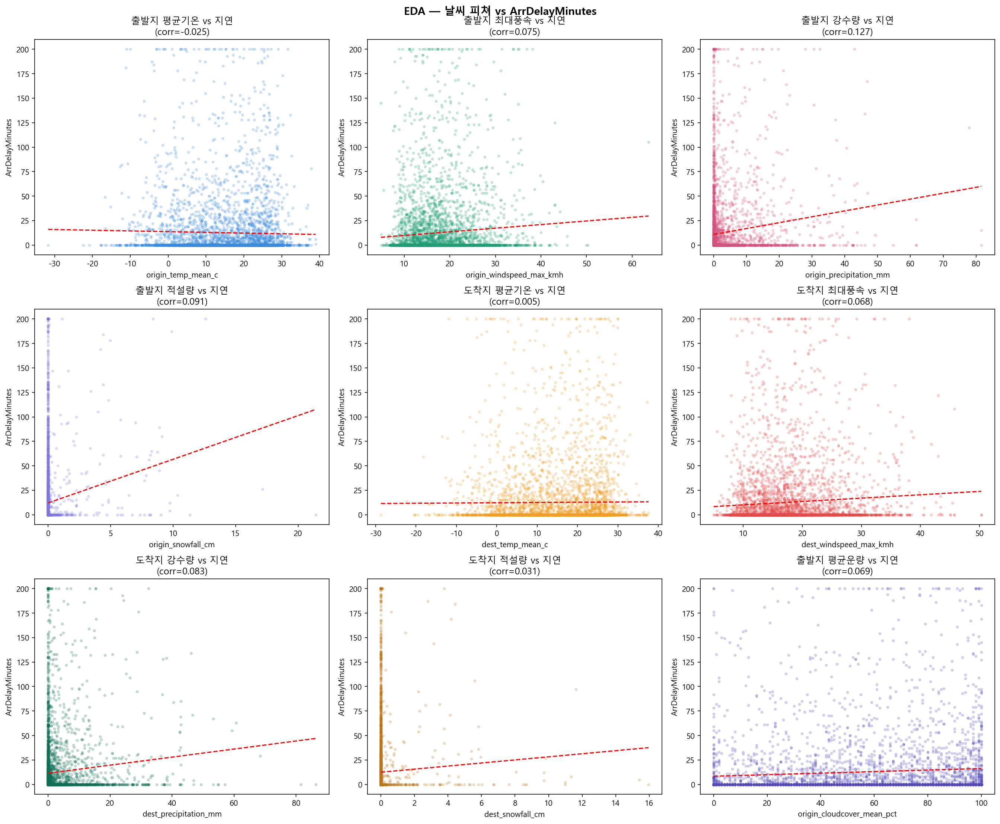
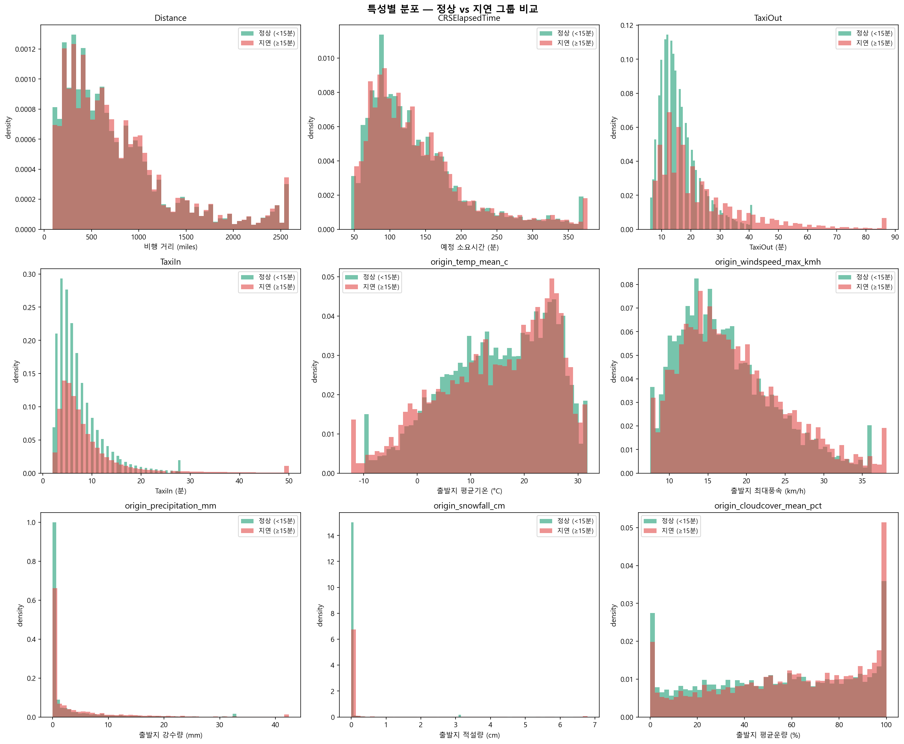
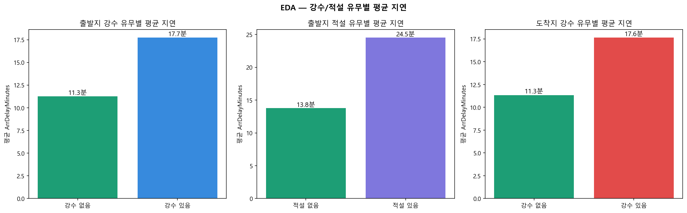
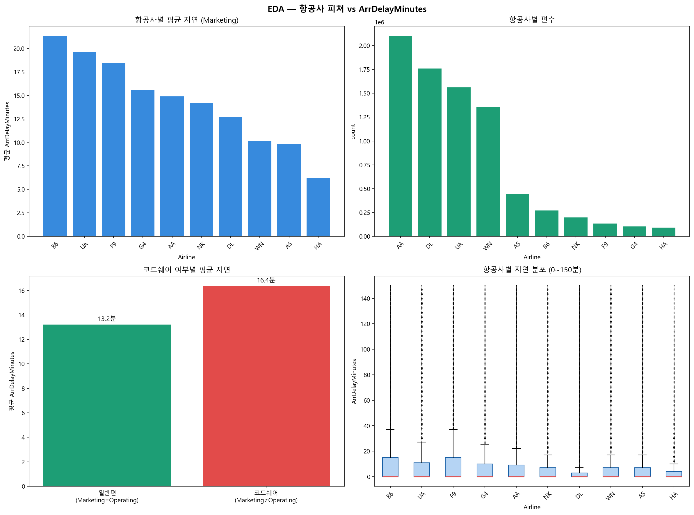
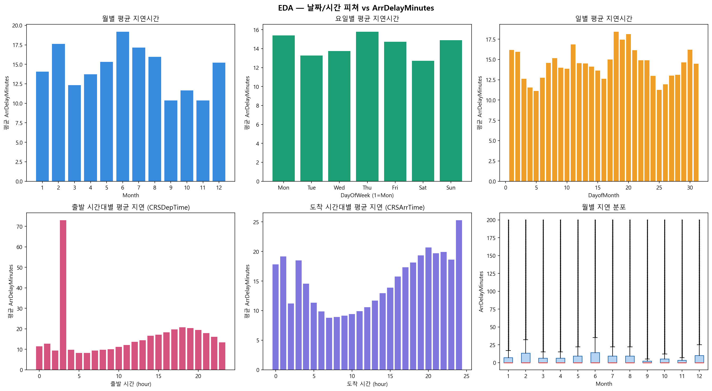
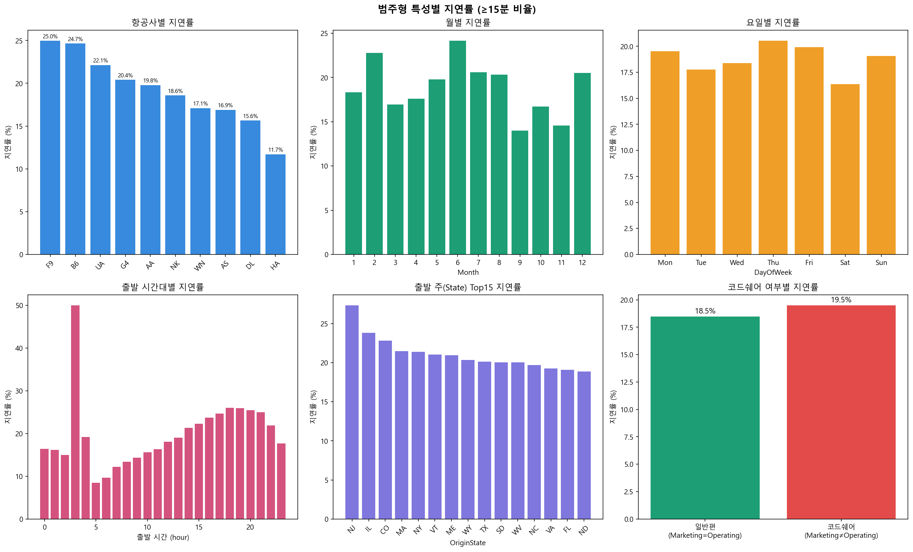
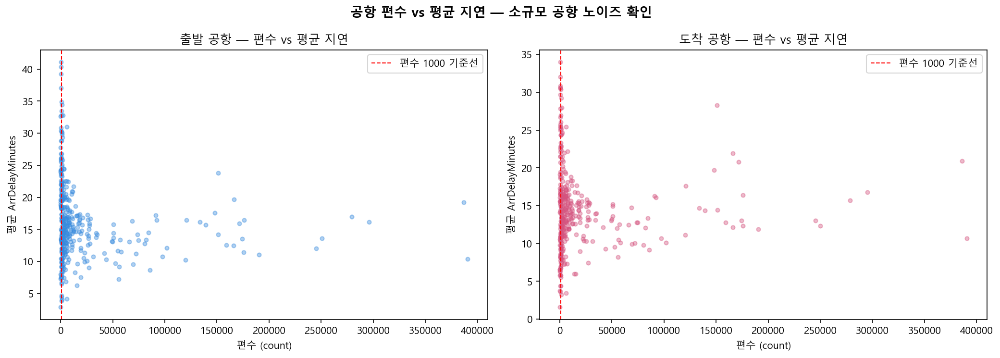
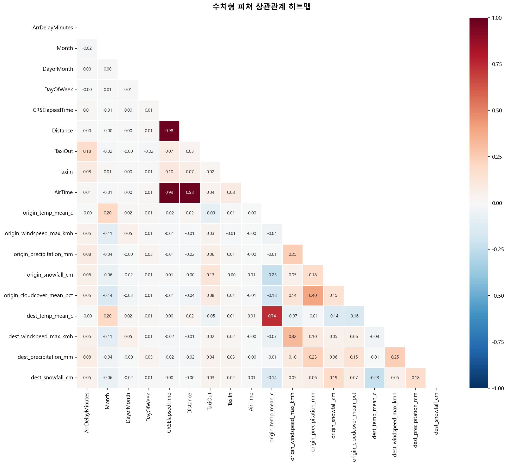

# 📄 산출물 1: 인공지능 데이터 전처리 결과서

## 1. 프로젝트 개요

### 1-1. 비즈니스 배경
- 비즈니스 출장객(전체의 20%)은 항공사 매출의 40~60%를 차지하는 핵심 고객군으로, 출장 2건 중 1건 이상에서 지연을 경험하며 8건 중 1건은 미팅 자체가 취소됨. 여행객은 지연 발생 시 선결제 숙박·투어 손실이 발생하며 대부분 보상받지 못함. 지연 예측 모델은 두 고객군 모두의 경험을 개선하고 항공사의 고수익 고객 이탈을 방지하는 수단이 될 수 있음

### 1-2. 비즈니스 목표
- 지연이 발생할 가능성이 있는 항공편을 사전에 식별하여 가장 최적의 항공편을 선택 가능하게 하는 서비스 제공

### 1-3. 머신러닝 활용 계획
| 항목 | 내용 |
|------|------|
| 문제 유형 | 이진 분류 (지연=1 / 정상 운행=0) |
| 예측 대상 | 기준일 이후 2주 이내 항공편의 지연 예측 |
| 활용 방안 | 지연 발생 항공편 예측 → 최적의 항공편 확인 → 항공편에 맞춰 일정 계획 |
| 기대 효과 | 항공편 지연으로 인한 손실 감소 |

### 1-4. 성공 기준 (Success Criteria)
- 모델 성능 기준: Recall ≥ 0.80 (지연 항공편 탐지율 우선)
- 비즈니스 기준: 지연 예측 정확도가 현재 경험적 판단 대비 향상

---

## 2. 데이터셋 소개

### 2-1. 데이터 기본 정보
| 항목 | 내용 |
|------|------|
| 데이터셋명 | Flight Status Prediction |
| 출처 | Kaggle |
| 수집 기간 | 2018.01 ~ 2022.07 |
| 전체 샘플 수 | 28,887,758건 |
| 특성(Feature) 수 | 79개 |
| 타겟(Target) | ArrDelayMinutes |
| 데이터 불균형 여부 | 지연 (≥15분) : 정상 (<15분) = 8.24 : 1.76 비율 |

### 2-2. 특성 목록 및 설명
| 특성명 | 데이터 타입 | 설명 | 예시값 |
|--------|------------|------|--------|
| FlightDate | object | 운항 날짜 | 2019-01-01 |
| Month | int64 | 월 | 1~12 |
| DayofMonth | int64 | 일 | 1~31 |
| DayOfWeek | int64 | 요일 | 1(월)~7(일) |
| CRSDepTime | int64 | 예정 출발 시각 | 800, 1430 |
| CRSArrTime | int64 | 예정 도착 시각 | 1020, 1650 |
| DepTime | float64 | 실제 출발 시각 | 758, 1437 |
| ArrTime | float64 | 실제 도착 시각 | 1015, 1644 |
| **항공사** |||||
| Marketing_Airline_Network | object | 마케팅 항공사 코드 | AA, DL, WN |
| Operating_Airline | object | 실제 운항 항공사 코드 | AA, DL, WN |
| **공항/노선** |||||
| Origin | object | 출발 공항 IATA 코드 | ATL, ORD, LAX |
| Dest | object | 도착 공항 IATA 코드 | ATL, ORD, LAX |
| OriginState | object | 출발 주(State) 코드 | GA, CA, TX |
| DestState | object | 도착 주(State) 코드 | GA, CA, TX |
| **비행 정보** |||||
| CRSElapsedTime | float64 | 예정 비행 소요시간(분) | 65, 178 |
| Distance | float64 | 비행 거리(마일) | 500, 2475 |
| TaxiOut | float64 | 게이트 출발~이륙 시간(분) | 10, 35 |
| TaxiIn | float64 | 착륙~게이트 도착 시간(분) | 5, 18 |
| AirTime | float64 | 실제 비행 시간(분) | 55, 160 |
| **지연 관련** |||||
| ArrDelayMinutes | float64 | 도착 지연 시간(분) — 타겟 | 0.0, 45.0 |
| **날씨** |||||
| origin_precipitation_mm | float64 | 출발지 강수량(mm) | 0.0, 12.4 |
| origin_snowfall_cm | float64 | 출발지 적설량(cm) | 0.0, 5.2 |
| origin_temp_mean_c | float64 | 출발지 평균 기온(°C) | -5.2, 28.3 |
| origin_temp_max_c | float64 | 출발지 최고 기온(°C) | -1.0, 35.0 |
| origin_temp_min_c | float64 | 출발지 최저 기온(°C) | -10.5, 22.0 |
| origin_windspeed_max_kmh | float64 | 출발지 최대 풍속(km/h) | 10.0, 65.0 |
| origin_windgusts_max_kmh | float64 | 출발지 최대 돌풍 속도(km/h) | 15.0, 80.0 |
| origin_cloudcover_mean_pct | int64 | 출발지 평균 운량(%) | 0~100 |
| dest_precipitation_mm | float64 | 도착지 강수량(mm) | 0.0, 8.2 |
| dest_snowfall_cm | float64 | 도착지 적설량(cm) | 0.0, 3.1 |
| dest_temp_mean_c | float64 | 도착지 평균 기온(°C) | -3.0, 30.1 |
| dest_temp_max_c | float64 | 도착지 최고 기온(°C) | 0.0, 38.0 |
| dest_temp_min_c | float64 | 도착지 최저 기온(°C) | -8.0, 24.0 |
| dest_windspeed_max_kmh | float64 | 도착지 최대 풍속(km/h) | 8.0, 55.0 |
| dest_windgusts_max_kmh | float64 | 도착지 최대 돌풍 속도(km/h) | 12.0, 70.0 |
| dest_cloudcover_mean_pct | int64 | 도착지 평균 운량(%) | 0~100 |
- 파생변수 활용일 제외한 중복, Leakage, 분석 제외 대상 컬럼 제외 항목

### 2-3. 타겟 변수 분포
- 지연 (≥15분): 4,942,413건 (17.6%)
- 정상 (<15분): 23,105,309건 (82.4%)
- → 클래스 불균형 여부 판단 및 처리 계획 기술

---

## 3. 탐색적 데이터 분석 (EDA)
- 데이터 컬럼과 행의 수가 너무 많은 관계로 데이터 행이 가장 많은 2019년 기준으로 분석

### 3-1. 기초 통계량
- 2019년 전체 운항 데이터 기준 (결항편 제거 후 7,865,708건)

**수치형 변수 요약**
| 특성명 | 평균 | 중앙값 | 표준편차 | 최솟값 | 최댓값 |
|--------|------|--------|----------|--------|--------|
| ArrDelayMinutes | 14.4 | 0.0 | 48.4 | 0.0 | 2,973.0 |
| CRSElapsedTime | 138.0 | 120.0 | 71.2 | -143.0 | 813.0 |
| Distance | 765.6 | 603.0 | 583.1 | 31.0 | 5,095.0 |
| AirTime | 107.3 | 89.0 | 69.2 | 4.0 | 1,557.0 |
| TaxiOut | 17.6 | 15.0 | 10.1 | 0.0 | 249.0 |
| TaxiIn | 7.8 | 6.0 | 6.2 | 0.0 | 316.0 |
| Month | 6.6 | 7.0 | 3.4 | 1 | 12 |
| DayofMonth | 15.7 | 16.0 | 8.8 | 1 | 31 |
| DayOfWeek | 3.9 | 4.0 | 2.0 | 1 | 7 |
| origin_temp_mean_c | 15.0 | 16.0 | 10.1 | -31.7 | 39.0 |
| origin_temp_max_c | 20.5 | 21.9 | 10.7 | -26.6 | 45.2 |
| origin_temp_min_c | 10.0 | 10.6 | 10.0 | -37.2 | 32.7 |
| origin_windspeed_max_kmh | 17.5 | 16.3 | 6.5 | 3.6 | 63.6 |
| origin_windgusts_max_kmh | 36.7 | 34.9 | 12.8 | 7.6 | 119.5 |
| origin_precipitation_mm | 2.9 | 0.0 | 6.9 | 0.0 | 103.9 |
| origin_snowfall_cm | 0.12 | 0.0 | 0.85 | 0.0 | 22.3 |
| origin_cloudcover_mean_pct | 54.1 | 56.0 | 31.0 | 0 | 100 |
| dest_temp_mean_c | 15.0 | 16.0 | 10.1 | -31.7 | 39.0 |
| dest_temp_max_c | 20.5 | 21.9 | 10.7 | -26.6 | 45.2 |
| dest_temp_min_c | 10.0 | 10.6 | 10.0 | -37.2 | 32.7 |
| dest_windspeed_max_kmh | 17.5 | 16.3 | 6.5 | 3.6 | 63.6 |
| dest_windgusts_max_kmh | 36.7 | 34.9 | 12.8 | 7.6 | 119.5 |
| dest_precipitation_mm | 2.9 | 0.0 | 6.9 | 0.0 | 103.9 |
| dest_snowfall_cm | 0.12 | 0.0 | 0.85 | 0.0 | 22.3 |
| dest_cloudcover_mean_pct | 54.1 | 56.0 | 31.0 | 0 | 100 |

**범주형 변수 요약**

| 특성명 | 고유값 수 | 최빈값 | 최빈값 비율 |
|--------|-----------|--------|-------------|
| Marketing_Airline_Network | 10 | AA | 26.0% |
| Operating_Airline | 26 | WN | 16.8% |
| Origin | 364 | ATL | 5.0% |
| Dest | 364 | ATL | 5.0% |
| OriginState | 49 | CA | 11.0% |
| DestState | 49 | CA | 11.0% |

### 3-2. 결측값 분석 ㅁㅁㅁㅁㅁㅁㅁㅁㅁㅁㅁㅁㅁㅁㅁㅁㅁㅁㅁㅁㅁㅁㅁㅁㅁㅁㅁㅁㅁㅁㅁㅁㅁㅁㅁㅁㅁㅁㅁㅁㅁㅁㅁㅁㅁㅁㅁㅁㅁㅁㅁㅁㅁㅁㅁㅁㅁㅁㅁㅁㅁㅁㅁㅁㅁㅁㅁㅁㅁㅁㅁㅁㅁㅁㅁㅁㅁㅁㅁㅁㅁㅁㅁㅁㅁㅁㅁㅁㅁㅁㅁㅁㅁㅁㅁㅁㅁㅁㅁㅁㅁㅁㅁㅁㅁㅁㅁㅁㅁㅁㅁㅁㅁㅁㅁㅁㅁㅁㅁㅁㅁㅁㅁㅁ
| 특성명 | 결측 수 | 결측률(%) | 처리 방안 |
|--------|---------|-----------|----------|
| TotalCharges | 11 | 0.15% | 중앙값 대체 |
| ... | | | |

### 3-3. 이상값 분석
 박스플롯 또는 IQR 기법으로 탐지
 이상값으로 판단된 특성 및 건수 기술
 처리 방법 (제거 / 클리핑 / 유지) 및 근거 명시

### 3-4. 특성별 분포 분석

#### 수치형 특성 — 정상 vs 지연 그룹 분포 비교
**[1] 비행 정보 피쳐 — 구간별 평균 지연**

 **Distance (비행 거리)**: 500~1,000마일 구간에 데이터가 집중된 right-skewed 
  분포. 거리 구간별 평균 지연이 13~15분으로 균일하여 거리 자체보다는 노선 
  특성을 내포하는 보조 피쳐 역할.
 **CRSElapsedTime (예정 소요시간)**: Distance와 상관계수 0.98로 거의 동일한 
  정보를 담고 있음. 다중공선성으로 인해 AirTime 제거 후 CRSElapsedTime과 
  Distance만 유지.
 **TaxiOut**: TaxiOut이 길수록 지연이 급증하는 강한 비선형 관계 확인. 
  60분 이상 구간에서 평균 지연 90분. 단, 실제 운항 후에만 알 수 있는 값으로 
  Leakage 가능성이 있어 최종 피쳐에서는 공항별/시간대별 과거 평균값
  (origin_taxiout_mean)으로 대체.
 **TaxiIn**: TaxiOut과 유사한 패턴. 동일하게 과거 평균값(dest_taxiin_mean)으로 대체.

**[2] 수치형 피쳐 — 정상 vs 지연 그룹 분포 비교**

 **Distance / CRSElapsedTime**: 두 그룹의 분포가 거의 동일. 거리/소요시간 자체는 
  지연 여부와 직접적인 선형 관계 없음 확인 (상관계수 0.00).
 **TaxiOut**: 지연 그룹(빨강)이 정상 그룹(초록) 대비 오른쪽으로 뚜렷하게 치우쳐 
  있음. 수치형 피쳐 중 타겟과의 상관계수 0.18로 가장 높음.
 **TaxiIn**: TaxiOut보다 차이가 작지만 지연 그룹의 꼬리가 더 긴 패턴 확인.
 **origin_temp_mean_c**: -10°C 이하 저온 구간에서 지연 그룹 비율이 상대적으로 
  높음. 결빙 및 제설 작업으로 인한 지연 효과로 해석. 선형 상관계수는 낮지만 
  비선형 관계 존재.
 **origin_windspeed_max_kmh**: 30km/h 이상 고풍속 구간에서 지연 그룹 비율 증가. 
  풍속과 지연의 비선형적 임계값 효과 확인.
 **origin_precipitation_mm / origin_snowfall_cm**: 0mm/cm에 데이터가 극단적으로 
  집중되어 분포 차이가 시각적으로 불명확. 이진 변수 변환 필요성 확인.
 **origin_cloudcover_mean_pct**: 100% 구간(완전 흐림)에서 지연 그룹 비율이 더 높음.

**[3] 날씨 피쳐 — 타겟과의 상관관계**

 전체 날씨 피쳐의 선형 상관계수가 0.03~0.13으로 낮음. 날씨와 지연의 관계가 
  단순 선형이 아닌 비선형(임계값 효과)임을 시사.
 트리 기반 모델(XGBoost, LightGBM)에서는 이러한 비선형 관계를 분기점으로 
  학습 가능.

**[4] 날씨 피쳐 — 강수/적설 이진 변수 효과**

 **강수 있음**: 강수 없음(11.3분) 대비 평균 지연 +6.4분 (17.7분).
 **적설 있음**: 적설 없음(13.8분) 대비 평균 지연 +10.7분 (24.5분). 날씨 피쳐 
  중 가장 강한 효과.
 **도착지 강수 있음**: 강수 없음(11.3분) 대비 +6.3분 (17.6분).
 연속형 강수량/적설량보다 이진 변수(has_precip, has_snow)로 변환 시 지연과의 
  관계가 더 명확히 드러남 → 이진 피쳐 파생 근거.

#### 범주형 특성 — 지연률(≥15분 비율) 비교
**[5] 항공사 피쳐**
  
 **항공사별 평균 지연**: B6(JetBlue) 21분, UA 19.6분으로 높고 HA(Hawaiian) 
  6.3분으로 가장 낮음. 최대 3.5배 차이로 항공사가 강력한 예측 피쳐임을 확인.
 **항공사별 편수**: AA, DL, UA, WN이 압도적으로 많아 데이터 불균형 존재. 
  모델링 시 주의 필요.
 **코드쉐어**: 코드쉐어편(16.4분) vs 일반편(13.2분)으로 평균 +3.2분 추가 지연.

**[6] 날짜/시간 피쳐 — 평균 지연**

 **월별**: 6월(19.2분) 최고, 9~11월(10.5분) 최저. 여름 성수기와 가을 비수기의 
  뚜렷한 계절성 확인.
 **요일별**: 토요일(12.6분) 최저, 목/월요일(15.6분) 최고. 주중 비즈니스 
  수요 집중 효과.
 **출발 시간대**: 오전 이른 시간 지연 낮고 저녁으로 갈수록 증가. 당일 누적 
  지연 효과 확인. 새벽 3시 스파이크는 전체 2건의 노이즈로 간주.

**[7] 범주형 피쳐 — 지연률 비교**

 **항공사별 지연률**: F9(25.0%), B6(24.7%) 최고, HA(11.7%) 최저. 최대 2.1배 차이.
 **월별 지연률**: 6월(24.5%) 최고, 10월(14.2%) 최저. 약 10%p 차이로 계절성 뚜렷.
  → month_sin/month_cos cyclic 인코딩 근거.
 **요일별 지연률**: 목요일(20.7%) 최고, 토요일(16.3%) 최저.
  → is_weekend 이진 피쳐 생성 근거.
 **출발 시간대별 지연률**: 오전 9~10시 최저(9%), 저녁 20~21시 최고(25~26%).
  → CRSDep_sin/CRSDep_cos cyclic 인코딩 근거.
 **코드쉐어 지연률**: 코드쉐어(19.5%) vs 일반편(18.5%). 지연 빈도보다 지연 
  강도에 더 큰 영향 → is_codeshare 이진 피쳐 생성 근거.
 **출발 주(State) 지연률**: NJ(29%), IL(24%), CO(23%) 순으로 동부/중부 허브 
  밀집 지역이 상위권.

**[8] 공항/노선 피쳐**

 **출발 공항별 평균 지연**: 소규모 공항에서 평균 지연이 40분 이상으로 높게 
  나타나나 편수가 극소수라 평균이 불안정.
 **출발 공항 편수**: ORD, ATL, DFW 등 대형 허브공항이 편수 압도적으로 많으나 
  평균 지연은 오히려 낮음.
 **주(State)별 평균 지연**: NJ, SD, VT 순으로 동부/북동부 주가 상위권. 
  날씨(눈, 강풍) 영향과 밀접.

**[9] 공항 편수 vs 평균 지연 산점도**

 편수 1,000건 미만 소규모 공항은 평균 지연이 5~40분으로 분산이 매우 큼. 
  통계적으로 불안정한 추정값.
 편수 1,000건 이상 대형 공항은 10~20분으로 수렴. 안정적인 패턴.
 공항 코드 단순 인코딩보다 노선별 집계 통계 피쳐(route_airtime_mean 등) 추가 
  근거. Origin/Dest는 카테고리 인코딩 적용

### 3-5. 상관관계 분석

#### 수치형 특성 간 상관계수 히트맵

#### 다중공선성 의심 특성 식별 (|r| > 0.8)
| 피쳐 쌍 | 상관계수 | 판단 | 처리 방법 |
|---------|----------|------|----------|
| CRSElapsedTime ↔ Distance | 0.98 | 다중공선성 | AirTime 제거, 두 피쳐 유지 |
| AirTime ↔ CRSElapsedTime | 0.99 | 다중공선성 | AirTime 제거 |
| AirTime ↔ Distance | 0.98 | 다중공선성 | AirTime 제거 |
| origin_temp_mean_c ↔ dest_temp_mean_c | 0.74 | 주의 수준 | 둘 다 유지 (출발/도착 구분 필요) |
| origin_cloudcover_mean_pct ↔ origin_precipitation_mm | 0.40 | 허용 범위 | 유지 |

 CRSElapsedTime, AirTime, Distance 세 피쳐의 상관계수가 0.98~0.99로 사실상 
 동일한 정보를 담고 있음. 비행 거리가 길수록 비행시간과 예정 소요시간이 함께 
 증가하는 구조적 특성 때문. AirTime은 실제 운항 후에만 알 수 있는 Leakage 
 피쳐이기도 하므로 제거하고 CRSElapsedTime과 Distance만 유지.

#### 타겟(ArrDelayMinutes)과 각 특성 간의 상관관계

| 특성명 | 상관계수 | 해석 |
|--------|----------|------|
| TaxiOut | 0.18 | 수치형 중 가장 높음 — Leakage로 과거 평균값으로 대체 |
| TaxiIn | 0.08 | 약한 양의 관계 — 동일하게 과거 평균값으로 대체 |
| origin_precipitation_mm | 0.08 | 강수량 많을수록 지연 증가 |
| origin_snowfall_cm | 0.06 | 적설 시 지연 증가 |
| origin_windspeed_max_kmh | 0.05 | 풍속 강할수록 지연 증가 |
| origin_cloudcover_mean_pct | 0.05 | 운량 많을수록 지연 증가 |
| Distance | 0.00 | 선형 관계 없음 |
| origin_temp_mean_c | -0.00 | 선형 관계 없음 |

 수치형 피쳐와 타겟 간 선형 상관관계가 전반적으로 낮음 (최대 0.18).
 이는 항공 지연이 단순 선형이 아닌 비선형적 관계를 가짐을 시사.
 풍속 임계값 초과, 적설 유무, 시간대 누적 효과 등 비선형 패턴은
 트리 기반 모델(XGBoost, LightGBM)에서 분기점으로 효과적으로 학습 가능.

#### 범주형 특성과 타겟 간의 관계

| 특성명 | 분석 방법 | 주요 결과 |
|--------|----------|----------|
| Marketing_Airline_Network | 항공사별 평균 지연 | F9(25.0%) ~ HA(11.7%), 최대 2.1배 차이 |
| Month | 월별 지연률 | 6월(24.5%) ~ 10월(14.2%), 10%p 차이 |
| DayOfWeek | 요일별 지연률 | 목요일(20.7%) ~ 토요일(16.3%) |
| CRSDepTime | 시간대별 지연률 | 오전 9~10시(9%) ~ 저녁 20~21시(25%) |
| OriginState | 주별 지연률 | NJ(29%) ~ 최저 약 13% |
| is_codeshare | 코드쉐어 여부별 지연률 | 코드쉐어(19.5%) vs 일반편(18.5%) |

 범주형 피쳐는 피어슨 상관계수로 측정이 불가하여 그룹별 지연률로 비교.
 항공사, 월, 시간대에서 그룹 간 차이가 뚜렷하게 나타나 예측 피쳐로서 유의미함을 확인.

### 3-6. EDA 주요 발견사항 (Insight)

- **발견 1**: 타겟(ArrDelayMinutes)의 64.3%가 0분으로 극단적인 zero-inflation 존재.
  평균(14.4분) vs 중앙값(0분)의 큰 격차가 이를 반영. 단순 회귀보다 이진 분류
  (15분 이상 지연 여부) 접근이 적합하며, 전체 데이터 기준 정상(80.5%) vs
  지연(19.5%)의 클래스 불균형 존재 → SMOTE 또는 class weight 조정 필요.

- **발견 2**: 항공사별 지연률이 F9(25.0%) ~ HA(11.7%)로 최대 2.1배 차이.
  항공사 운영 방식 및 허브 공항 특성이 지연에 직접적인 영향을 미치는
  강력한 예측 피쳐임을 확인 → Marketing_Airline_Network 유지.

- **발견 3**: 코드쉐어편이 일반편 대비 평균 +3.2분, 지연률 +1%p 추가 발생.
  지연 빈도보다 지연 강도에 더 큰 영향 → is_codeshare 이진 피쳐 파생 근거.

- **발견 4**: 출발지 적설 시 평균 +10.7분, 강수 시 +6.4분 지연 증가.
  연속형 강수량/적설량의 선형 상관계수는 낮지만(0.06~0.08) 이진 변수 변환 시
  효과가 명확히 드러남 → origin_has_precip, origin_has_snow 이진 피쳐 파생 근거.

- **발견 5**: CRSElapsedTime ↔ AirTime ↔ Distance 간 상관계수 0.98~0.99로
  다중공선성 확인. AirTime은 Leakage 피쳐이기도 하므로 제거 →
  CRSElapsedTime과 Distance만 유지.

- **발견 6**: 출발 시간대별 지연률이 오전 9~10시(9%) ~ 저녁 20~21시(25%)로
  뚜렷한 패턴 확인. 당일 누적 지연 효과가 저녁 시간대로 전파됨.
  시간의 순환성 반영을 위해 → CRSDep_sin/CRSDep_cos cyclic 인코딩 적용.

- **발견 7**: 월별 지연률이 6월(24.5%) ~ 10월(14.2%)로 10%p 차이.
  뚜렷한 계절성 존재 → month_sin/month_cos cyclic 인코딩 적용.

- **발견 8**: 소규모 공항(편수 1,000건 미만)은 평균 지연 분산이 5~40분으로
  매우 커 통계적으로 불안정. 대형 허브공항은 10~20분으로 수렴 →
  Origin/Dest 단순 인코딩보다 노선별 집계 통계 피쳐(route_airtime_mean,
  origin_taxiout_mean 등) 추가 근거.

- **발견 9**: 수치형 피쳐와 타겟 간 선형 상관관계가 전반적으로 낮음(최대 0.18).
  항공 지연은 비선형적 임계값 효과(풍속, 적설, 시간대 누적)를 가지므로
  트리 기반 모델(XGBoost, LightGBM)이 적합.

→ 위 인사이트를 바탕으로 피쳐 엔지니어링 단계에서 cyclic 인코딩(sin/cos),
이진 변수 생성(has_precip, has_snow, is_codeshare, is_weekend),
노선/공항별 집계 통계 피쳐(route_airtime_mean, origin_taxiout_mean 등)를 추가 적용.

---

## 4. 데이터 전처리 ㅁㅁㅁㅁㅁㅁㅁㅁㅁㅁㅁㅁㅁㅁㅁㅁㅁㅁㅁㅁㅁㅁㅁㅁㅁㅁㅁㅁㅁㅁㅁㅁㅁㅁㅁㅁㅁㅁㅁㅁㅁㅁㅁㅁㅁㅁㅁㅁㅁㅁㅁㅁㅁㅁㅁㅁㅁㅁㅁㅁㅁㅁㅁㅁㅁㅁㅁㅁㅁㅁㅁㅁㅁㅁㅁㅁㅁㅁㅁㅁㅁㅁㅁㅁㅁㅁㅁㅁㅁㅁㅁㅁㅁ

### 4-1. 결측값 처리
| 특성명 | 처리 방법 | 근거 |
|--------|----------|------|
| TotalCharges | 중앙값(median) 대체 | 이상치 영향 최소화 |
| ... | | |

### 4-2. 이상값 처리
| 특성명 | 탐지 방법 | 처리 방법 | 처리 전 범위 | 처리 후 범위 |
|--------|----------|----------|------------|------------|
| tenure | IQR | 상한/하한 클리핑 | | |

### 4-3. 인코딩 (범주형 → 수치형)
| 특성명 | 인코딩 방법 | 변환 결과 | 선택 근거 |
|--------|------------|----------|----------|
| gender | Label Encoding | Male→0, Female→1 | 이진 변수 |
| Contract | One-Hot Encoding | 3개 더미 변수 생성 | 명목형, 3개 범주 |
| ... | | | |

### 4-4. 특성 공학 (Feature Engineering)
- 생성한 새 특성 목록과 생성 근거
  - 예: `charge_per_month = TotalCharges / tenure` (기간 대비 청구액 밀도)
  - 예: `high_risk_flag` = (tenure < 6) & (MonthlyCharges > 70)

### 4-5. 불균형 데이터 처리
| 방법 | 적용 여부 | 처리 전 비율 | 처리 후 비율 |
|------|----------|------------|------------|
| SMOTE (오버샘플링) | O / X | 이탈:유지=X:Y | X:Y |
| class_weight 조정 | O / X | | |
| 언더샘플링 | O / X | | |

### 4-6. 스케일링
| 방법 | 적용 특성 | 선택 근거 |
|------|----------|----------|
| StandardScaler | tenure, MonthlyCharges, TotalCharges | 정규분포 근사 특성 |
| MinMaxScaler | 적용 안 함 | |

### 4-7. 불필요 특성 제거
| 제거 특성 | 제거 근거 |
|----------|----------|
| customerID | 고유 식별자, 예측에 무관 |
| ... | |

---

## 5. 데이터셋 분리

### 5-1. 분리 기준
| 항목 | 설명 |
|------|------|
| 분리 비율 | Train 65% / Test 35% |
| Stratify | 타겟 클래스 비율 유지 (stratify=y) |
| Random Seed | 42 |

### 5-2. 분리 결과
| 구분 | 전체 샘플 | 이탈(1) | 유지(0) | 이탈 비율 |
|------|----------|---------|---------|----------|
| 전체 | X,XXX | XXX | X,XXX | X.X% |
| Train | X,XXX | XXX | X,XXX | X.X% |
| Test | X,XXX | XXX | X,XXX | X.X% |

### 5-3. 최종 입력 특성 목록
- 최종 사용 특성 수: XX개
- 특성 목록:
  - 수치형 (X개): tenure, MonthlyCharges, TotalCharges, ...
  - 범주형 인코딩 (X개): gender_encoded, Contract_Month-to-month, ...
  - 생성 특성 (X개): charge_per_month, high_risk_flag, ...

---

## 6. 전처리 결과 요약

### 6-1. 전처리 전/후 데이터 비교
| 항목 | 전처리 전 | 전처리 후 |
|------|----------|----------|
| 전체 샘플 수 | X,XXX | X,XXX |
| 특성 수 | XX | XX |
| 결측값 수 | XX | 0 |
| 이상값 수 | XX | 0 |
| 범주형 특성 수 | XX | 0 (인코딩 완료) |

### 6-2. 전처리 파이프라인 요약

[원본 데이터]
    │
    ├─ 결측값 처리 (중앙값 대체)
    ├─ 이상값 처리 (IQR 클리핑)
    ├─ 인코딩 (Label + OHE)
    ├─ 특성 공학 (신규 변수 생성)
    ├─ 불균형 처리 (SMOTE)
    ├─ 스케일링 (StandardScaler)
    └─ Train/Test 분리 (8:2)

[전처리 완료 데이터] → 모델 학습 준비 완료

### 6-3. 저장 파일 목록
| 파일명 | 설명 |
|--------|------|
| data/processed/X_train.csv | 학습용 입력 데이터 |
| data/processed/X_test.csv | 테스트용 입력 데이터 |
| data/processed/y_train.csv | 학습용 타겟 |
| data/processed/y_test.csv | 테스트용 타겟 |
| 3_model/scaler.pkl | 스케일러 저장 파일 |
